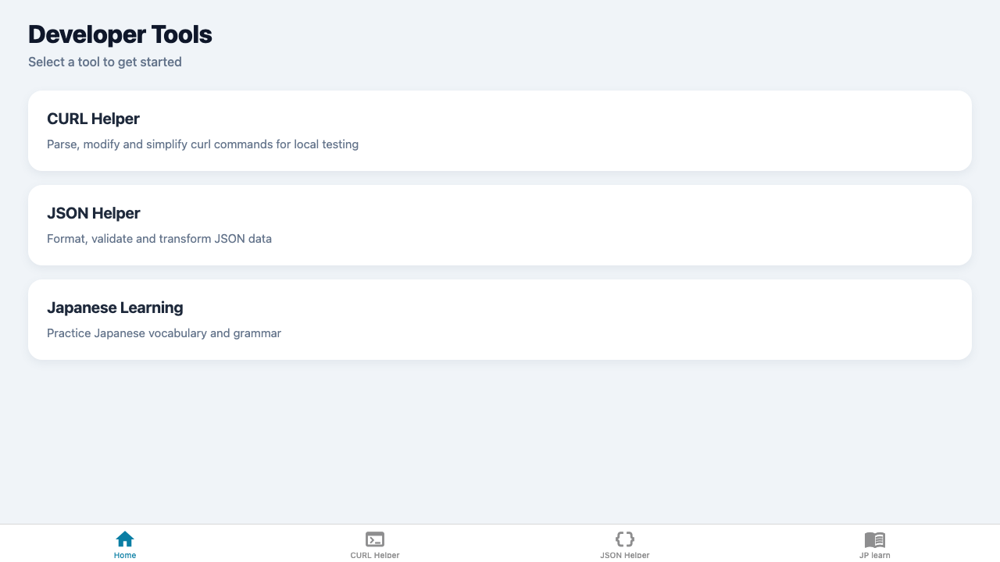
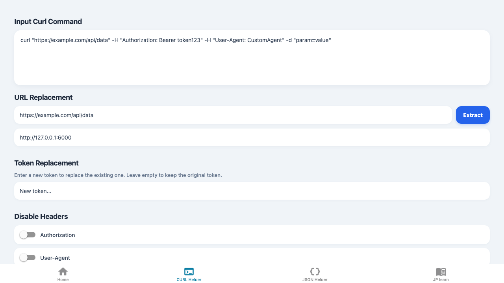
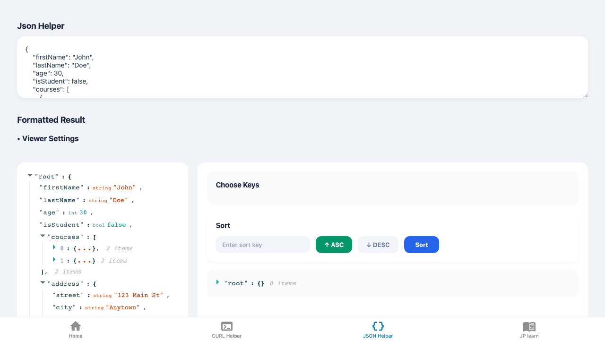
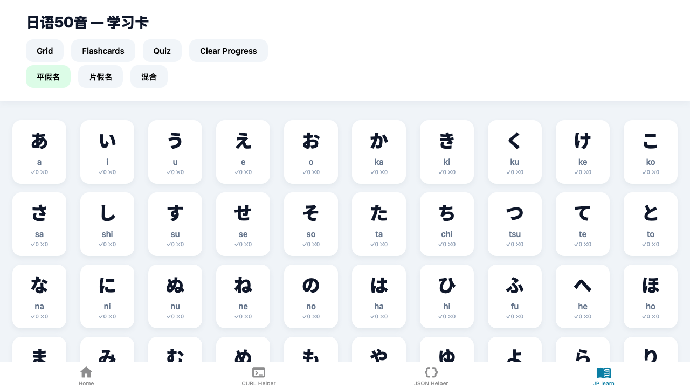

# Dev Tools

<div align="center">
  
  
  
  
  <p><em>从左到右: Home, CURL Helper, JSON Helper, JP Learn</em></p>
</div>

A collection of developer utility tools built with [Expo](https://expo.dev) and React Native. Works on Web, iOS, and Android.

## 🎯 Online Demo

Try the live demo: [wenzhi-tools.expo.app](https://wenzhi-tools--hdqft35ppr.expo.app/)

## ✨ Features

### CURL Helper
Parse, modify, and simplify curl commands for local development:
- URL replacement for redirecting requests to localhost
- Token replacement for authentication testing
- Header filtering (remove unnecessary headers)
- One-click minimize mode for cleaner commands

### JSON Helper
Format, validate, and transform JSON data:
- Pretty print with syntax highlighting
- Interactive tree view with expand/collapse
- Extract and filter specific keys from arrays
- Reorder object keys

### Japanese Learning (50音)
Practice Hiragana and Katakana:
- Grid view with progress tracking
- Flashcard mode with flip animation
- Quiz mode with spaced repetition
- Audio pronunciation support

## Getting Started

### Prerequisites
- Node.js 18+
- npm or yarn

### Installation

```bash
npm install
```

### Development

```bash
# Start development server
npx expo start

# Run on specific platform
npx expo start --web
npx expo start --ios
npx expo start --android
```

### Build for Production

```bash
# Build web version
npx expo export --platform web

# Deploy to EAS
npx eas deploy
```

## Project Structure

```
├── app/                    # Expo Router pages
│   ├── (tabs)/            # Tab-based navigation
│   │   ├── index.tsx      # Home screen
│   │   ├── curl_helper.tsx
│   │   ├── json_helper.tsx
│   │   └── japanese_learning.tsx
│   └── _layout.tsx        # Root layout
├── components/
│   ├── custom/            # Tool-specific components
│   ├── json_helper/       # JSON helper components
│   └── ui/                # Shared UI components
├── src/
│   └── styles/            # Global styles
├── assets/                # Images and fonts
├── constants/             # Theme colors
└── hooks/                 # Custom React hooks
```

## Tech Stack

- **Framework**: [Expo](https://expo.dev) (SDK 53)
- **Navigation**: [Expo Router](https://docs.expo.dev/router/introduction/)
- **UI**: React Native with platform-specific optimizations
- **State**: React hooks + AsyncStorage for persistence

## License

MIT
